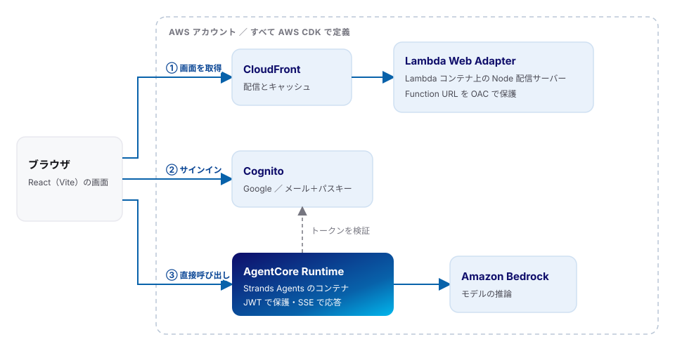

# agent-builder-skills

AWS で AI エージェントの Web アプリを作るための、コーディングエージェント向けスキル集です。
Amazon Bedrock AgentCore と Strands Agents でエージェントを動かし、AWS CDK と Lambda Web Adapter で画面を配信する構成を、実際に作って詰まったところを中心にまとめています。

公式ドキュメントの代わりではありません。**公式どおりにやったのに動かなかったときの原因と対処**を集めたものです。

## アーキテクチャ



画面の配信とエージェントの実行を別のコンテナに分け、ブラウザからエージェントを直接呼び出します。Lambda を経由させないので、エージェントの長い応答が Lambda の応答サイズと実行時間の上限を受けません。

この構成で動いている実物は [minorun365/marp-agent](https://github.com/minorun365/marp-agent) です。

## スキル一覧

| スキル | 中身 |
|---|---|
| `kb-lambda-web-adapter-cdk` | 全体構成の入口。スタックの分け方、画面を配信する Lambda コンテナ、CloudFront の設定、ローカル開発、検証 |
| `kb-agentcore-cdk` | AgentCore Runtime の CDK 定義、JWT 認証、コンテナ、Browser Tool、Gateway、コストの罠 |
| `kb-strands-agentcore` | Strands Agents の Agent・ツール定義・イベント処理・会話履歴 |
| `kb-agentcore-observability` | OpenTelemetry の設定、トレースが出ないときの調べ方、メトリクス |
| `kb-agentcore-identity` | 外部サービスへのアウトバウンド認証（3LO・M2M） |
| `kb-demo-app-auth` | Cognito の Google ログイン＋パスキー、ログイン画面の作り |
| `kb-frontend-sse` | SSE ストリーミングの受け方、タイムアウト、リトライ |
| `cdkd-deploy` | コミュニティ製の CDKD で CDK アプリを高速にデプロイする手順と安全の線引き（英語） |

## 使い方

### Claude Code のプラグインとして入れる

```
/plugin marketplace add minorun365/agent-builder-skills
/plugin install agent-builder-skills@minorun365-agent-skills
```

### フォルダをコピーして使う

`skills/` の中身は素の Markdown です。必要なものだけを自分の環境のスキル置き場へコピーしてください。

```bash
git clone https://github.com/minorun365/agent-builder-skills.git
cp -R agent-builder-skills/skills/kb-agentcore-cdk ~/.claude/skills/
```

Claude Code 以外のコーディングエージェントでも、`SKILL.md` と `references/` を読ませればそのまま使えます。

## 注意

- AWS のサービスとライブラリは更新が速いので、書いてある内容は確認した時点のものです。モデル ID・料金・対応リージョンは、使うときに公式の情報で確かめてください
- CDKD は AWS の公式ツールではなくコミュニティ製です。本番で使うかどうかの判断は `cdkd-deploy` を読んでください

## ライセンス

Apache License 2.0
